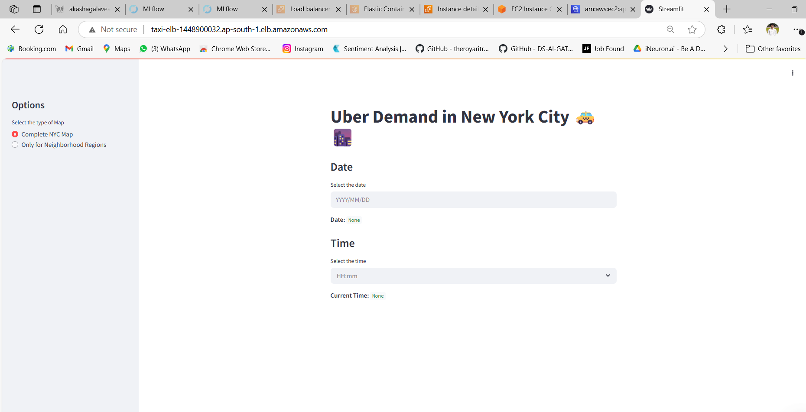

---

<h1 align="center">🚖 NYC Uber Demand Predictor</h1>

<p align="center">
  <b>Forecasting Uber demand across New York City — every 15 minutes, every neighborhood.</b><br/>
  <i>From historical ride data to real-time maps — empowering smarter, data-driven urban mobility.</i>
</p>

---

## 🔍 Overview

This is a real-time, ML-powered application that predicts **Uber demand for the next 15 minutes** across NYC regions. Developed using **Streamlit**, and deployed with a **scalable AWS infrastructure**, it enables Uber drivers, fleet managers, and planners to anticipate demand — not just react to it.

---

## 💼 Problem Statement

Urban ride demand changes by the minute. Without timely predictions, Uber drivers miss out on pickups, while fleet operations struggle with inefficiencies.

---

## 🎯 Objective

* Predict **15-minute future Uber demand** using spatiotemporal features
* Train on **January–February 2016** data and forecast **March 2016**
* Deploy with a **Streamlit UI**, powered by a **Dockerized ML backend**
* Enable **real-time insights** for drivers and fleet operators
* Implement **auto-scaled, CI/CD-enabled** infrastructure using AWS services

---

## 💡 Business Impact

| 🧑‍🤝‍🧑 Stakeholder      | 📈 Value Delivered                                                             |
| ------------------------- | ------------------------------------------------------------------------------ |
| 🚕 **Uber Drivers**       | Know where demand is about to surge — increase chances of pickups and earnings |
| 🚗 **Fleet Managers**     | Position vehicles proactively to reduce idle time and fuel consumption         |
| 🏙️ **Urban Planners**    | Analyze near-real-time rider behavior to optimize traffic and event strategies |
| 📊 **Data Analysts**      | Explore NYC’s ride-hailing patterns at 15-minute granularity                   |
| 💼 **Uber as a Business** | Improves service availability and maximizes utilization across the city        |

---

## 🧠 ML Intelligence

| Component     | Description                                           |
| ------------- | ----------------------------------------------------- |
| Model         | `GradientBoostingRegressor`                           |
| Target        | Uber pickups for the **next 15 minutes**              |
| Features      | Timestamp (date + time), neighborhood region          |
| Training Data | Jan–Feb 2016 Uber pickup data                         |
| Versioning    | `DVC` for pipelines, `MLflow` for experiment tracking |
| Output        | Real-time prediction mapped to region and time        |

---


---

## 🗺️ App Features

* 🖥️ **Streamlit-Based Web App**
* ⏱️ Predicts demand for the **next 15-minute window**
* 🗺️ Map selection: Complete NYC or region-specific
* 📅 Select any **date/time** from March 2016
* 📦 Dockerized ML backend
* 🧪 Fully reproducible experiments with tracked metrics

---

## ☁️ Cloud Architecture (AWS)

| Component                 | Description                                      |
| ------------------------- | ------------------------------------------------ |
| 🐳 **Docker**             | Containerized backend and frontend               |
| 🧠 **Flask API**          | Serves model inference to Streamlit UI           |
| ☁️ **AWS EC2**            | Hosts the application in a scalable VM instance  |
| ⚖️ **Load Balancer**      | Distributes traffic for high availability        |
| 📈 **Auto Scaling Group** | Scales EC2 instances up/down based on usage      |
| 🧬 **Launch Template**    | Ensures consistent EC2 instance configuration    |
| 🚀 **AWS CodeDeploy**     | Enables continuous deployment via CI/CD pipeline |

---

## 🎥 Live Demo – Proof of Deployment

▶️ **Watch the App Running on AWS**
[](https://youtu.be/3qjKD__omR0)


> The video demonstrates the complete cloud deployment — Streamlit frontend, Docker backend, and CI/CD pipeline with load-balanced autoscaling on AWS.

---

## 🧰 Tech Stack

| Layer           | Tools & Frameworks                                                              |
| --------------- | ------------------------------------------------------------------------------- |
| **ML Modeling** | `GradientBoostingRegressor`, `scikit-learn`, `pandas`, `joblib`                 |
| **MLOps**       | `DVC`, `MLflow`, `Git`, versioned pipelines                                     |
| **Frontend**    | `Streamlit` for fast, clean, interactive UI                                     |
| **Deployment**  | `Docker`, `AWS EC2`, `ECR`, `Load Balancer`, `Auto Scaling Group`, `CodeDeploy` |

---

## 🧪 Run Locally – Try It Yourself

### 1️⃣ Start the App

```bash
git clone https://github.com/akashagalave/Taxi-Demand-Prediction-System.git
cd Taxi-Demand-Prediction-System
pip install -r requirements.txt
streamlit run app.py
```

The app will launch at `http://localhost:8000`.

---

### 2️⃣ Use the Interface

* Select a **region**
* Pick a **date & time**
* View **predicted ride demand** for the **next 15 minutes** on the map

---

## 📁 Data Overview

* 📍 **Source**: NYC Uber pickup data (Jan–Mar 2016)
* 📊 **Columns**: `Date`, `Time`, `Region`, `Trip Count`
* 🧹 Cleaned, time-split, and grouped for 15-minute interval modeling

---


---

## 📌 Project Status

✅ Deployed with autoscaling and CI/CD
📹 Demo recorded on live AWS infrastructure
📦 Currently offline (infra shut down for cost control)
💻 Fully reproducible via local environment

---

## 🙌 Built With Grit By

👨‍💻 [Akash Agalave](https://github.com/akashagalave)

---

